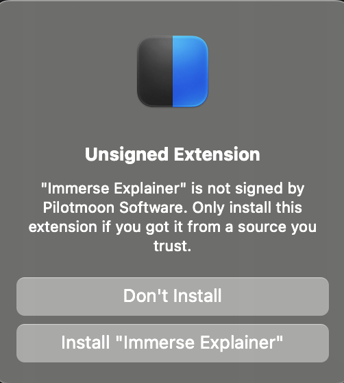
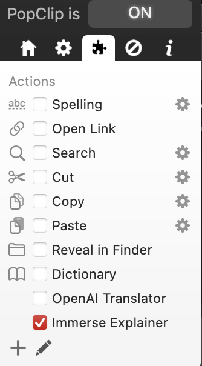
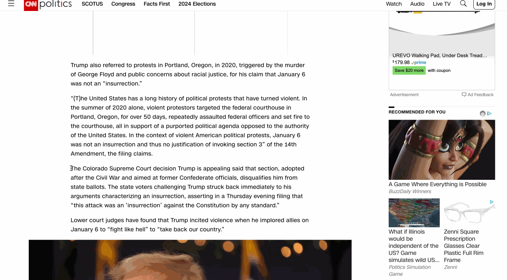

Desktop Application Global Clip Extensions
------------------------------------------
This extension enables you to select text in any desktop application and explain words in it with Immerse Explainer.
# macOS
## PopClip

[PopClip](https://pilotmoon.com/popclip/) is a well-established clip word software on macOS, it provides a perfect plug-in mechanism, we provide its plug-in, the installation steps are as follows:

* 1. Download and install [PopClip](https://pilotmoon.com/popclip/)
* 2. Download [ImmerseExplainer.popclipextz](https://github.com/iq180fq200/ImmerseExplainer/releases/download/v0.1/ImmerseExplainer.popclipextz)
* 3. Double-click the downloaded ImmerseExplainer.popclipextz and click the Install "OpenAI Translator" button in the popup window to finish the installation

  

      
  

* 4. Open Immerse Explainer in PopClip

  

      
  

* 5. The effect is as follows

    

