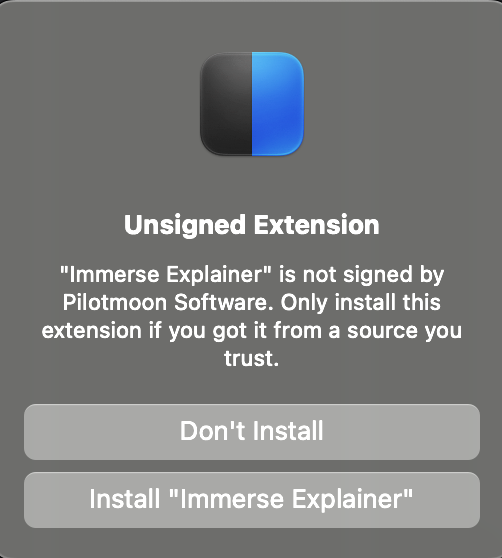
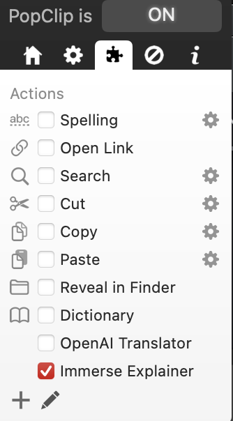

Desktop Application Global Clip Extensions
------------------------------------------
This extension enables you to select text in any desktop application and explain words in it with Immerse Explainer.
# macOS
## PopClip

[PopClip](https://pilotmoon.com/popclip/) is a well-established clipping tool on macOS that provides an excellent plugin mechanism. We have developed a plugin for PopClip to integrate Immerse Explainer. Follow these steps to install the plugin:
* 1. Download and install [PopClip](https://pilotmoon.com/popclip/)
* 2. Download [The plugin](https://github.com/iq180fq200/ImmerseExplainer/releases/download/v1.1/ImmerseExplainer.popclipextz)
* 3. Double-click the downloaded ImmerseExplainer.popclipextz and click the Install "OpenAI Translator" button in the popup window to finish the installation

  

      
  

* 4. Activate Immerse Explainer in PopClip

  

      
  

* 5. Usage

    

