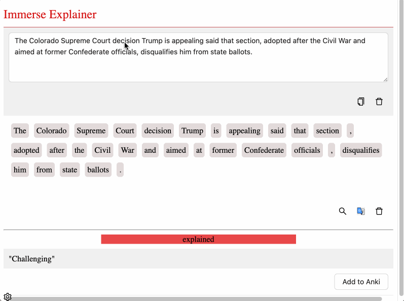
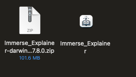
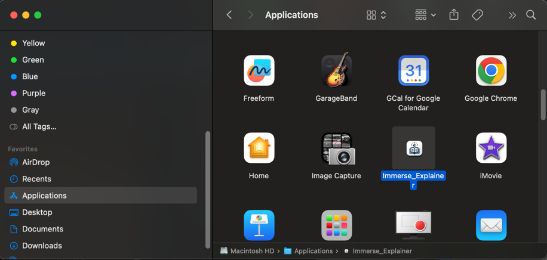
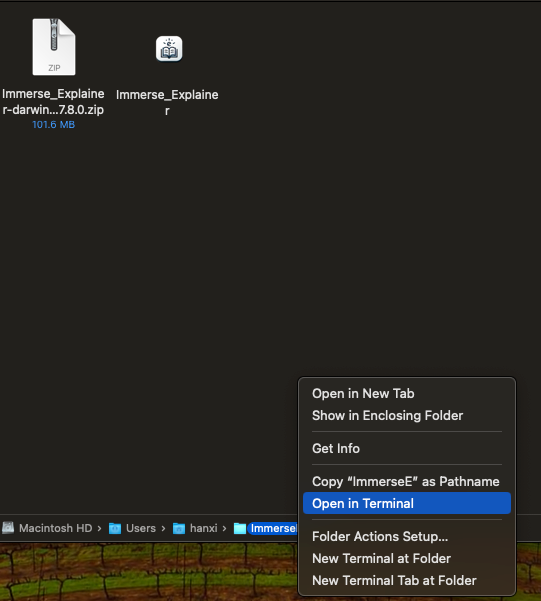

# Immerse Explainer: Learn Language as Native Speakers

Immerse Explainer is an AI-driven, context-aware phrase explainer designed for language learners. Note: The current version supports MacOS only.

Instead of merely translating phrases, Immerse Explainer provides explanations based on the context in which you encountered them. This approach helps you think directly in your target language—a method native speakers use and many experts believe accelerates language learning.

Additionally, Immerse Explainer seamlessly integrates with ANKI, a popular flashcard app that leverages the memory curve for efficient learning. With just one click, you can add phrases to ANKI for convenient review across your devices.
<br><div align="center">
</div>

# Installation (MacOS only)
## 1. Install ANKI
   Download and install ANKI from the [official website](https://apps.ankiweb.net/). Make sure ANKI is open when you use Immerse Explainer.

## 2. Add the AnkiConnect Add-on
   AnkiConnect is a plugin that allows Immerse Explainer to communicate with ANKI’s database. Follow the instructions on the [AnkiConnect](https://ankiweb.net/shared/info/2055492159) page to install it.

## 3. Install Immerse Explainer
Download the latest version of Immerse Explainer from [the release page](https://github.com/iq180fq200/ImmerseExplainer/releases/download/v1.2/Immerse_Explainer-darwin-arm64-7.8.0.zip). Then, follow the instructions below to install it:
- Unzip the downloaded file by double-clicking it. Then you should see the following files:
  <p align="center">
      
  </p>
- Move the Immerse_Explainer.app file to your Applications folder.
    <p align="center">
        
    </p>
- Open terminal in the Applications folder.
    <p align="center">
        
    </p>
- Run the following command in the terminal to remove quarantine attributes:
    ```bash
    xattr -cr Immerse_Explainer.app
    ```
- Double-click the Immerse_Explainer.app to launch the application.
## 4. Optional: Install the Immerse Explainer PopClip Extension
If you’d like your selected text to be automatically sent to Immerse Explainer, install PopClip and add the Immerse Explainer PopClip extension by following the instructions [here](./PopClip.md)
<p align="center">
    
</p>
<br>

# Configuration
## Add your openAI API key
Open Immerse Explainer and click the settings icon in the bottom left corner. Then enter your openAI API key into the input box. Note that you must purchase your token [here](https://platform.openai.com/usage) for your API keys to work. You can obtain your API key from [here](https://platform.openai.com/api-keys).

# Contributing
## Test the Immerse Explainer in Dev-mode
If you want to contribute or run Immerse Explainer in development mode, follow these steps:
Run the following command (the first command only needs to be run once unless changes are made to the ./Clip-extensions or ./Anki directories):

```bash
Copy
source buildAll.bash  # Builds the PopClip extension and the Anki connector.
npm start             # Launches the Immerse Explainer app in dev mode.
```

## Building in Production mode
To compile a production-ready version of Immerse Explainer:
```bash
source buildAll.bash # build the popclip extension and the Anki connector
npm run make # build the ImmerseExplainer app
```
The executable program will be in the ./out directory. And the popclip extension will be in the ./dist directory.

# License
[MIT](https://choosealicense.com/licenses/mit/)

# Special Thanks
Special thanks to [@Codesbiome](https://github.com/codesbiome) for providing the electron-react-typescript template.
