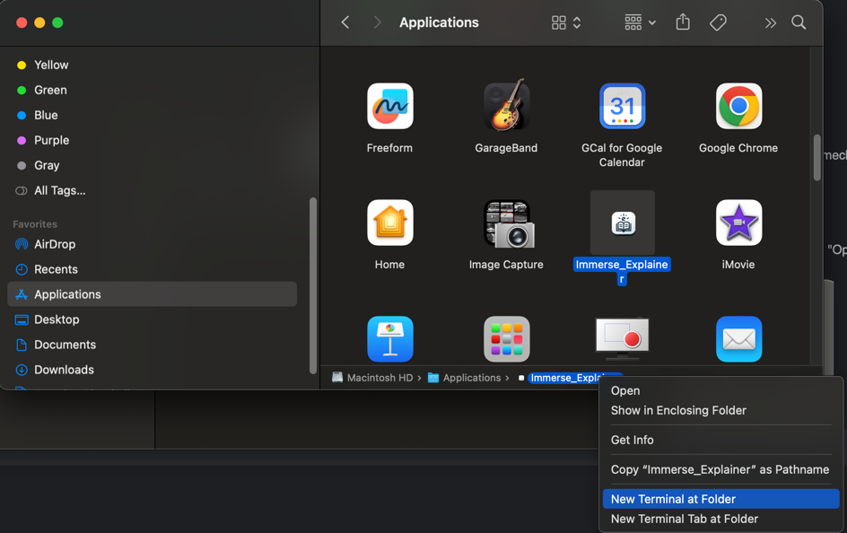

# Immerse Explainer

OpenAI based context-aware phrase explainer for English learners. The current version is only for mac-os users.

Core features:
- **Context aware phrase explainer**. The explainer will automatically detect the context of the phrase and explain it accordingly. 
- **Full English environment (You can choose to have no translation but only explanation using English)**. Many exlpert believe that the best way to learn a language is to forget your mother language. That's also the core idea behind the immerse explainer. 


<br>


- **Support add words to ANKI by one-click.** ANKI is a popular memory-curve based flashcard app for language learners. By adding phrases to Anki, you can then review your words using mobile or laptop.
- **Cross Application.** You can use immerse-explainer in for any app on your PC.

Special thanks to [@Codesbiome](https://github.com/codesbiome) for providing the electron-react-typescript template.

# Installation (MacOS only)
## 1. Install Anki
Install ANKI, a popular memory-curve based flashcard app to your computer. You can download and install it from [here](https://apps.ankiweb.net/). Make sure your Anki is open when using Immerse Explainer.
## 2. Add AnkiConnect add-on to ANKI
AnkiConnect is a plugin for Anki that allows other programs to connect to Anki's database. You can download and install it by following the instructions [here](https://ankiweb.net/shared/info/2055492159).
## 3. Install Immerse Explainer
Download the latest version of Immerse Explainer from [here](https://github.com/iq180fq200/ImmerseExplainer/releases/download/v0.0/Immerse_Explainer-darwin-arm64-7.8.0.zip) . Then, follow the instructions below to install it:
- Unzip the downloaded file by double-clicking it. Then you should get the following:
  <p align="center">
      
  </p>
- Open the directory in the terminal
    <p align="center">
        
    </p>
- Run the following command in the terminal:
    ```bash
    xattr -cr Immerse_Explainer.app
    ```
- Double click the Immerse_Explainer.app to open it.
## 4. Optional: Install Immerse Explainer PopClip Extension
If you want to have your selected text automatically pasted to Immerse Explainer, you can install PopClip and the Immerse Explainer PopClip extension by following the instructions [here](./PopClip.md)
<br>

# Configure Immerse Explainer
## Add your openAI API key
Open Immerse Explainer and click the setting icon in the bottom left corner. Then add your openAI API key to the input box. Note that you must purchase your token [here](https://platform.openai.com/usage) for your openAI key to be valid. You can get your openAI API key from [here](https://platform.openai.com/api-keys).

# Contribute
## Test the Immerse Explainer in Dev-mode
To contribute the Immerse Explainer and compile the code in dev-mode, you need to run the following commands (Note the first command below only needs to be run once if you didn't make any change to the ./Clip-extensions and ./Anki directories.):

```bash
source buildAll.bash # build the popclip extension and the Anki connector. 
npm start  # build the ImmerseExplainer app
```
## Build the Immerse Explainer in Production mode
To get the production-mode executable program, run the following commands in order:
```bash
source buildAll.bash # build the popclip extension and the Anki connector
npm run make # build the ImmerseExplainer app
```
The executable program will be in the ./out directory. And the popclip extension will be in the ./dist directory.

# License
[MIT](https://choosealicense.com/licenses/mit/)